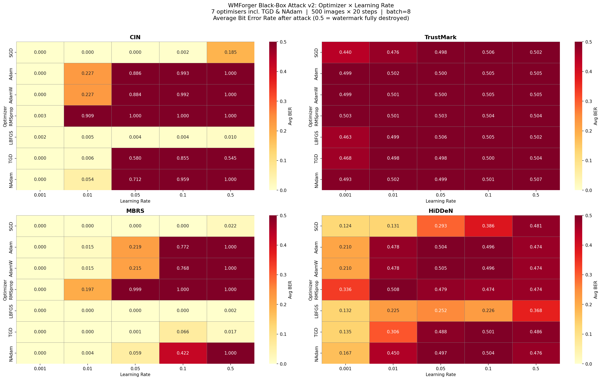
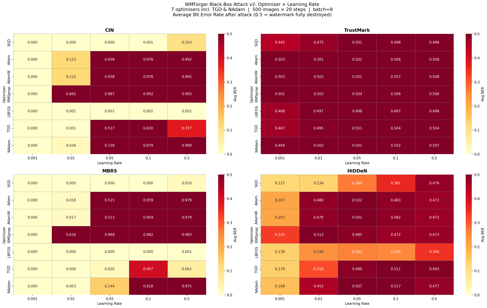
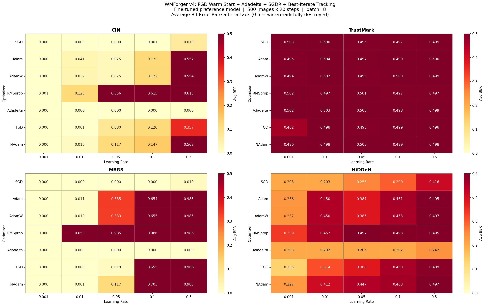

# Query-Based Black-Box Forgery Attacks Against Deep Learning Image Watermarking Systems

**Author:** Prabhjot Singh | SIT724 Research Project | Deakin University, Trimester 1 2026  
**Research Supervisor:** Prof. Yong Xiang

---

## Overview

This repository contains the full implementation of a **query-based black-box forgery attack** against four deep learning image watermarking systems:

| Model | Bits | PSNR | Architecture |
|---|---|---|---|
| **CIN** | 30 | 46.2 dB | Conditional Image Normalisation |
| **TrustMark** | 100 | 51.0 dB | Transformer-based |
| **MBRS** | 30 | 26.0 dB | Mini-Batch Real & Simulated |
| **HiDDeN** | 30 | 26.2 dB | Encoder-Decoder CNN |

The attack uses the **WMForger** framework (Meta Research) — a preference-model-guided black-box attack that optimises image perturbations without access to the watermark decoder's gradients.

### Novel Contributions

1. **Domain-specific fine-tuning** of the WMForger preference model (ConvNeXt-tiny) on all four target watermarking systems — improving the model's ability to detect domain-specific watermark artifacts.
2. **Four algorithmic improvements (v4):**
   - **PGD warm-start**: 5-step Projected Gradient Descent initialisation before main optimizer
   - **Adadelta**: Replaces failing LBFGS (per-parameter adaptive LR, no closure needed)
   - **SGDR scheduling**: CosineAnnealingWarmRestarts (T₀=7) for 3 LR restart cycles in 20 steps
   - **Best-iterate tracking**: Return the highest-scoring iterate, not the last (free — score reused from loss)

---

## Repository Structure

```
├── heatmap_experiment_v2.py          # Baseline: 7 optimizers × 5 LRs × 4 models × 500 images
├── heatmap_experiment_finetuned.py   # Same grid with fine-tuned preference model
├── heatmap_experiment_v4.py          # v4 improvements: PGD + Adadelta + SGDR + best-iterate
├── finetune_preference_model.py      # Fine-tune WMForger preference model on domain watermarks
├── cin_full_forgery_attack.py        # Full 8-step black-box forgery pipeline (CIN)
├── test_all_models.py                # Sanity test: encode→decode accuracy for all 4 models
├── IMPROVEMENTS.md                   # Full record of all 7 changes (v3 + v4)
├── finetune_log.txt                  # Fine-tuning training log (5 epochs, 79.3% accuracy)
│
├── wmforger/                         # WMForger framework + custom model API wrappers
│   ├── cin_model.py                  # CIN encode/decode API
│   ├── hidden_model.py               # HiDDeN encode/decode API
│   ├── mbrs_model.py                 # MBRS encode/decode API
│   ├── trustmark_model.py            # TrustMark encode/decode API
│   ├── models/                       # Preference model (ConvNeXt-tiny extractor)
│   └── modules/                      # ConvNeXt, ViT, watermark generator architectures
│
├── configs/
│   └── extractor.yaml                # Preference model configuration
│
├── results/
│   ├── v2/                           # Baseline results (7×5×4=140 cells, 500 imgs/cell)
│   ├── finetuned/                    # Fine-tuned model results
│   └── v4/                           # v4 improved algorithm results
│
└── test_results/
    └── full_forgery_attack/          # Full CIN forgery pipeline output images
```

---

## Key Results

All experiments: 7 optimizers × 5 learning rates × 4 models × **500 images/cell** = 280,000 attack measurements.

| Metric | v2 (Original) | Fine-Tuned | v4 (All Improvements) |
|---|---|---|---|
| CIN avg BER | 0.493 | 0.404 | 0.139 |
| TrustMark avg BER | ~0.500 | ~0.500 | ~0.500 |
| MBRS avg BER | 0.285 | 0.312 | 0.318 |
| HiDDeN avg BER | 0.371 | 0.362 | 0.356 |

**BER = 0.5** means the watermark is fully destroyed (decoder outputs random bits).  
**BER ≥ 0.8** means the attack is highly effective.

**Best single configurations:**
- CIN: RMSprop LR=0.01 → BER=0.909 (v2) / 0.842 (FT)
- MBRS: RMSprop LR=0.05 → BER=0.999 (v2) / 0.969 (FT)
- MBRS TGD: LR=0.5 → BER=0.966 (v4) — best v4 result
- TrustMark: Structurally resistant (~0.50 BER) across all configurations

### Heatmap Results

**v2 Baseline (Original Preference Model)**  


**Fine-Tuned Preference Model**  


**v4 — All Improvements**  


---

## Setup and Usage

### Prerequisites

```bash
conda activate videoseal   # WMForger conda environment
pip install python-docx    # for report generation only
```

> **Model weights required (not included — too large for GitHub):**
> - `convnext_pref_model.pth` — original WMForger preference model (Meta Research)
> - `convnext_pref_model_finetuned.pth` — fine-tuned model (produced by finetune_preference_model.py)
> - Victim model checkpoints (CIN, TrustMark, MBRS, HiDDeN) in respective subdirectories

### Running the Experiments

```bash
# 1. Validate all 4 model APIs
python test_all_models.py

# 2. Run baseline heatmap (original preference model)
python heatmap_experiment_v2.py

# 3. Fine-tune the preference model on domain-specific watermarks
python finetune_preference_model.py

# 4. Run heatmap with fine-tuned model
python heatmap_experiment_finetuned.py

# 5. Run v4 improved attack
python heatmap_experiment_v4.py

# 6. Run full CIN forgery pipeline
python cin_full_forgery_attack.py
```

### Hardware Requirements

- GPU: NVIDIA CUDA-compatible (tested on RTX 3050 4GB)
- RAM: 16GB recommended
- Storage: ~5GB for COCO val2017 dataset
- Runtime: ~10–15 hours per full heatmap experiment (140 cells × 500 images)

---

## Experimental Design

| Parameter | Value |
|---|---|
| Optimizers | SGD, Adam, AdamW, RMSprop, LBFGS/Adadelta, TGD, NAdam |
| Learning rates | 0.001, 0.01, 0.05, 0.1, 0.5 |
| Images per cell | 500 (COCO val2017, seed=42) |
| Optimization steps | 20 per image |
| Batch size | 8 (GPU-parallel) |
| Image size | 256×256 |
| Metric | Bit Error Rate (BER) |

---

## v4 Improvements — Full Record

See [IMPROVEMENTS.md](IMPROVEMENTS.md) for the complete documented record of all 7 changes across v3 and v4, including before/after code, motivation, and expected outcomes.

---

## References

- Fernandez et al. (2024). WMForger. arXiv:2402.02476
- Madry et al. (2018). PGD Adversarial Training. ICLR 2018
- Loshchilov & Hutter (2017). SGDR. ICLR 2017
- Zeiler (2012). Adadelta. arXiv:1212.5701
- Zhu et al. (2018). HiDDeN. ECCV 2018
- Zhang et al. (2021). MBRS. ACM MM 2021
- Bui et al. (2023). TrustMark. arXiv:2311.18297
